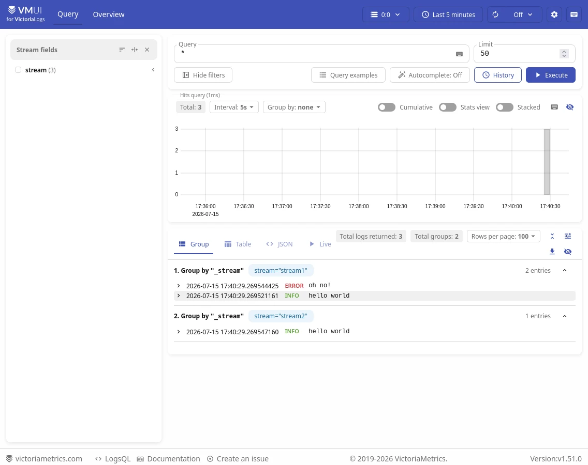

It is recommended to read [README](https://docs.victoriametrics.com/victorialogs/)
and [Key Concepts](https://docs.victoriametrics.com/victorialogs/keyconcepts/)
before you start working with VictoriaLogs.

There are two ways to get started with VictoriaLogs:

* [Try it locally](https://docs.victoriametrics.com/victorialogs/quickstart/#try-it-locally) - if you just want to see how VictoriaLogs works,
  go with the single binary: download it, start it with one command, ingest a few logs
  and query them in the built-in Web UI in a couple of minutes. No Docker, no configuration files
  and no extra components are required;
* [Install it](https://docs.victoriametrics.com/victorialogs/quickstart/#how-to-install-and-run-victorialogs) - if you want to set up VictoriaLogs
  for real use, pick an installation method (pre-built binaries, Docker, Helm charts,
  Kubernetes operator or building from source).

If you'd rather not install anything at all, try the [VictoriaLogs demo playground](https://play-vmlogs.victoriametrics.com/).

Whichever way you choose, you may also find interesting the other sections of this page,
like [how to configure VictoriaLogs](https://docs.victoriametrics.com/victorialogs/quickstart/#how-to-configure-victorialogs)
and the [Docker demos](https://docs.victoriametrics.com/victorialogs/quickstart/#docker-demos) integrating VictoriaLogs
with various log collectors.

## Try it locally

The fastest way to try VictoriaLogs on your own machine is its binary - the only thing needed to run it.

### Step 1: Download the binary

Create a directory for this test drive, so all the files created along the way stay in one place:

```sh
mkdir vl-quick-start && cd vl-quick-start
```

Download the `victoria-logs-<os>-<arch>-<version>.tar.gz` archive for your OS and architecture
from the [releases page](https://github.com/VictoriaMetrics/VictoriaLogs/releases/latest)
and unpack it. It contains a single `victoria-logs-prod` binary.

For example, on Linux with `amd64` architecture:

```sh
curl -L -O https://github.com/VictoriaMetrics/VictoriaLogs/releases/download/v1.51.0/victoria-logs-linux-amd64-v1.51.0.tar.gz
tar xzf victoria-logs-linux-amd64-v1.51.0.tar.gz
```

The binary is self-contained and requires no installation - it is ready to run as is.

### Step 2: Start VictoriaLogs

Starting VictoriaLogs is as simple as executing the binary, with no arguments at all:

```sh
./victoria-logs-prod
```

VictoriaLogs prints a couple of dozen log lines on start, describing the storage, caches
and memory limits it sets up. Look for these two lines confirming that it is up and running:

```sh
2026-07-15T14:28:30.642Z    info    app/victoria-logs/main.go:56    started VictoriaLogs in 0.000 seconds; see https://docs.victoriametrics.com/victorialogs/
2026-07-15T14:28:30.643Z    info    lib/httpserver/httpserver.go:152    started server at http://0.0.0.0:9428/
```

That's it - VictoriaLogs is running, listening on port `9428` and ready to accept logs.
If you list the `vl-quick-start` directory, you can see a new `victoria-logs-data` directory
created next to the binary - this is where the ingested logs are stored.

There are no logs stored yet, so let's ingest some.

### Step 3: Ingest some logs

VictoriaLogs accepts logs via [many popular protocols](https://docs.victoriametrics.com/victorialogs/data-ingestion/).
For example, push a few log lines in JSON line format with a plain `curl` command:

```sh
echo '{ "log": { "level": "info", "message": "hello world" }, "date": "0", "stream": "stream1" }
{ "log": { "level": "error", "message": "oh no!" }, "date": "0", "stream": "stream1" }
{ "log": { "level": "info", "message": "hello world" }, "date": "0", "stream": "stream2" }
' | curl -X POST -H 'Content-Type: application/stream+json' --data-binary @- \
  'http://localhost:9428/insert/jsonline?_stream_fields=stream&_time_field=date&_msg_field=log.message'
```

The `date` field set to `"0"` tells VictoriaLogs to use the current timestamp for the ingested log lines.
See [JSON stream API docs](https://docs.victoriametrics.com/victorialogs/data-ingestion/#json-stream-api)
for details on the other parameters.

Now that some logs are stored, it's time to look at them.

### Step 4: Explore the logs

Open [http://localhost:9428/select/vmui](http://localhost:9428/select/vmui) in your browser to access
the built-in [Web UI](https://docs.victoriametrics.com/victorialogs/querying/#web-ui) for querying and exploring logs.

Enter a query in the input field and press `Enter`. For example:

* `*` - returns all the ingested logs;
* `log.level:error` - only the logs with `error` level;
* `hello` - the logs containing the word `hello` in their message.

The `*` query should return the three log lines ingested at the previous step, grouped by log stream:



Queries are written in [LogsQL](https://docs.victoriametrics.com/victorialogs/logsql/) - a simple yet powerful
query language for logs. The same queries can also be executed via the
[HTTP API](https://docs.victoriametrics.com/victorialogs/querying/#http-api):

```sh
curl http://localhost:9428/select/logsql/query -d 'query=log.level:*'
```

So far the only stored logs are the three hand-made lines from the previous step - let's collect something more interesting.

### Step 5 (optional): Collect logs from your system

On Linux with systemd, the system journal is the easiest source of real logs. The following command
pushes the last 1000 entries of the journal to VictoriaLogs, using the journal fields for the
message, the timestamp and the [log stream](https://docs.victoriametrics.com/victorialogs/keyconcepts/#stream-fields):

```sh
journalctl -o json -n 1000 | curl -X POST -H 'Content-Type: application/stream+json' --data-binary @- \
  'http://localhost:9428/insert/jsonline?_msg_field=MESSAGE&_time_field=__REALTIME_TIMESTAMP&_stream_fields=_SYSTEMD_UNIT'
```

Now explore the collected logs in the [Web UI](http://localhost:9428/select/vmui). For example, query `error`
to find the journal messages mentioning errors. Note that every systemd unit became its own log stream,
so logs of a particular service can be queried with a [stream filter](https://docs.victoriametrics.com/victorialogs/logsql/#stream-filter)
like `{_SYSTEMD_UNIT="dbus.service"}` - substitute the unit name with any one appearing in your query results.

For continuous log collection, VictoriaLogs integrates with [journald](https://docs.victoriametrics.com/victorialogs/data-ingestion/journald/)
and popular log collectors such as [Vector](https://docs.victoriametrics.com/victorialogs/data-ingestion/vector/),
[Fluent Bit](https://docs.victoriametrics.com/victorialogs/data-ingestion/fluentbit/) and
[others](https://docs.victoriametrics.com/victorialogs/data-ingestion/).

Once you're done experimenting, tidying everything up takes a single command.

### Cleanup

Stop VictoriaLogs with `Ctrl+C`. All the ingested logs live in the `victoria-logs-data` directory -
delete it if you want to start from scratch. To remove all traces of this test drive,
delete the whole `vl-quick-start` directory created at [step 1](https://docs.victoriametrics.com/victorialogs/quickstart/#step-1-download-the-binary).

This test drive only scratches the surface of what VictoriaLogs can do. Ready for a real setup?
Continue with the installation options below, or learn the [key concepts](https://docs.victoriametrics.com/victorialogs/keyconcepts/)
of VictoriaLogs first.

## How to install and run VictoriaLogs

The following options are available:

- [To run pre-built binaries](https://docs.victoriametrics.com/victorialogs/quickstart/#pre-built-binaries)
- [To run Docker image](https://docs.victoriametrics.com/victorialogs/quickstart/#docker-image)
- [To run in Kubernetes with Helm charts](https://docs.victoriametrics.com/victorialogs/quickstart/#helm-charts)
- [To run in Kubernetes with VictoriaMetrics Operator (VLSingle / VLCluster CRDs)](https://docs.victoriametrics.com/operator/resources/)
- [To build VictoriaLogs from source code](https://docs.victoriametrics.com/victorialogs/quickstart/#building-from-source-code)

### Pre-built binaries

Pre-built binaries for VictoriaLogs are available at the [releases](https://github.com/VictoriaMetrics/VictoriaLogs/releases/) page.
Just download the archive for the needed operating system and architecture, unpack it, and run `victoria-logs-prod` from it.

For example, the following commands download VictoriaLogs archive for Linux/amd64, unpack and run it:

```sh
curl -L -O https://github.com/VictoriaMetrics/VictoriaLogs/releases/download/v1.51.0/victoria-logs-linux-amd64-v1.51.0.tar.gz
tar xzf victoria-logs-linux-amd64-v1.51.0.tar.gz
./victoria-logs-prod -storageDataPath=victoria-logs-data
```

VictoriaLogs is ready for [data ingestion](https://docs.victoriametrics.com/victorialogs/data-ingestion/)
and [querying](https://docs.victoriametrics.com/victorialogs/querying/) at the TCP port `9428` now!
It has no external dependencies, so it can run in various environments without additional setup or configuration.
VictoriaLogs automatically adapts to the available CPU and RAM resources. It also automatically sets up and creates
the needed indexes during [data ingestion](https://docs.victoriametrics.com/victorialogs/data-ingestion/).

See also:

- [How to configure VictoriaLogs](https://docs.victoriametrics.com/victorialogs/quickstart/#how-to-configure-victorialogs)
- [How to ingest logs into VictoriaLogs](https://docs.victoriametrics.com/victorialogs/data-ingestion/)
- [How to query VictoriaLogs](https://docs.victoriametrics.com/victorialogs/querying/)

### Docker image

You can run VictoriaLogs in a Docker container. It is the easiest way to start using VictoriaLogs.
Here is the command to run VictoriaLogs in a Docker container:

```sh
docker run --rm -it -p 9428:9428 -v ./victoria-logs-data:/victoria-logs-data \
  docker.io/victoriametrics/victoria-logs:v1.51.0 -storageDataPath=victoria-logs-data
```

See also:

- [How to configure VictoriaLogs](https://docs.victoriametrics.com/victorialogs/quickstart/#how-to-configure-victorialogs)
- [How to ingest logs into VictoriaLogs](https://docs.victoriametrics.com/victorialogs/data-ingestion/)
- [How to query VictoriaLogs](https://docs.victoriametrics.com/victorialogs/querying/)

### Helm charts

You can run VictoriaLogs in a Kubernetes environment
with [VictoriaLogs single](https://docs.victoriametrics.com/helm/victoria-logs-single/)
or [cluster](https://docs.victoriametrics.com/helm/victoria-logs-cluster/) Helm charts.

See also [victoria-logs-collector](https://docs.victoriametrics.com/helm/victoria-logs-collector/) Helm chart for collecting logs
from all the Kubernetes containers and sending them to VictoriaLogs.

### VictoriaMetrics Operator

You can also run VictoriaLogs in Kubernetes using [VictoriaMetrics Operator](https://docs.victoriametrics.com/operator/resources/).

- [`VLSingle` CRD](https://docs.victoriametrics.com/operator/resources/vlsingle/) declaratively defines a single-node VictoriaLogs deployment.
- [`VLCluster` CRD](https://docs.victoriametrics.com/operator/resources/vlcluster/) declaratively defines a VictoriaLogs cluster and lets the Operator manage `vlinsert`, `vlselect` and `vlstorage` components for you.

### Building from source code

Follow these steps to build VictoriaLogs from source code:

- Check out the VictoriaLogs source code:

  ```sh
  git clone https://github.com/VictoriaMetrics/VictoriaLogs
  cd VictoriaLogs
  ```

- Check out a specific commit if needed:

  ```sh
  git checkout <commit-hash-here>
  ```

- If you build VictoriaLogs from source in order to verify some bugfix or feature in [Web UI](https://docs.victoriametrics.com/victorialogs/querying/#web-ui),
  then run `make vmui-update` command before the next step. This command requires Docker to be installed on your computer.
  See [how to install Docker](https://docs.docker.com/engine/install/).

- Build VictoriaLogs (requires Go to be installed on your computer. See [how to install Go](https://golang.org/doc/install)):

  ```sh
  make victoria-logs
  ```

- Run the built binary:

  ```sh
  bin/victoria-logs -storageDataPath=victoria-logs-data
  ```

VictoriaLogs is ready for [data ingestion](https://docs.victoriametrics.com/victorialogs/data-ingestion/)
and [querying](https://docs.victoriametrics.com/victorialogs/querying/) at the TCP port `9428` now!
It has no external dependencies, so it can run in various environments without additional setup or configuration.
VictoriaLogs automatically adapts to the available CPU and RAM resources. It also automatically sets up and creates
the needed indexes during [data ingestion](https://docs.victoriametrics.com/victorialogs/data-ingestion/).

An alternative approach is to build VictoriaLogs inside a Docker builder container. This approach doesn't require Go to be installed,
but it does require Docker on your computer. See [how to install Docker](https://docs.docker.com/engine/install/):

```sh
make victoria-logs-prod
```

This will build the `victoria-logs-prod` executable inside the `bin` folder.

See also:

- [How to configure VictoriaLogs](https://docs.victoriametrics.com/victorialogs/quickstart/#how-to-configure-victorialogs)
- [How to ingest logs into VictoriaLogs](https://docs.victoriametrics.com/victorialogs/data-ingestion/)
- [How to query VictoriaLogs](https://docs.victoriametrics.com/victorialogs/querying/)

## How to configure VictoriaLogs

VictoriaLogs is configured via command-line flags. All command-line flags have sane defaults,
so there is generally no need to tune them. VictoriaLogs runs smoothly in most environments
without additional configuration.

Pass `-help` to VictoriaLogs in order to see the list of supported command-line flags with their description and default values:

```sh
/path/to/victoria-logs -help
```

VictoriaLogs stores ingested data in the `victoria-logs-data` directory by default. The directory can be changed
via `-storageDataPath` command-line flag. See [Storage](https://docs.victoriametrics.com/victorialogs/#storage) for details.

By default, VictoriaLogs stores [log entries](https://docs.victoriametrics.com/victorialogs/keyconcepts/) with timestamps
in the time range `[now-7d, now]` and drops logs outside this time range
(i.e., a retention of 7 days). See [Retention](https://docs.victoriametrics.com/victorialogs/#retention) for details on controlling retention
for [ingested](https://docs.victoriametrics.com/victorialogs/data-ingestion/) logs.

We recommend setting up monitoring of VictoriaLogs according to [Monitoring](https://docs.victoriametrics.com/victorialogs/#monitoring).

See also:

- [How to ingest logs into VictoriaLogs](https://docs.victoriametrics.com/victorialogs/data-ingestion/)
- [How to query VictoriaLogs](https://docs.victoriametrics.com/victorialogs/querying/)

## Docker demos

Docker Compose demos for the single-node and cluster versions of VictoriaLogs that include log collection,
monitoring, alerting, and Grafana are available [here](https://github.com/VictoriaMetrics/VictoriaLogs/tree/master/deployment/docker#readme).

Docker Compose demos that integrate VictoriaLogs and various log collectors:

- [Filebeat demo](https://github.com/VictoriaMetrics/VictoriaLogs/tree/master/deployment/docker/victorialogs/filebeat)
- [Fluentbit demo](https://github.com/VictoriaMetrics/VictoriaLogs/tree/master/deployment/docker/victorialogs/fluentbit)
- [Logstash demo](https://github.com/VictoriaMetrics/VictoriaLogs/tree/master/deployment/docker/victorialogs/logstash)
- [Vector demo](https://github.com/VictoriaMetrics/VictoriaLogs/tree/master/deployment/docker/victorialogs/vector)
- [Promtail demo](https://github.com/VictoriaMetrics/VictoriaLogs/tree/master/deployment/docker/victorialogs/promtail)

You can use the [VictoriaLogs single](https://docs.victoriametrics.com/helm/victoria-logs-single/) or [cluster](https://docs.victoriametrics.com/helm/victoria-logs-cluster/) Helm charts to run the Vector demo in Kubernetes.
